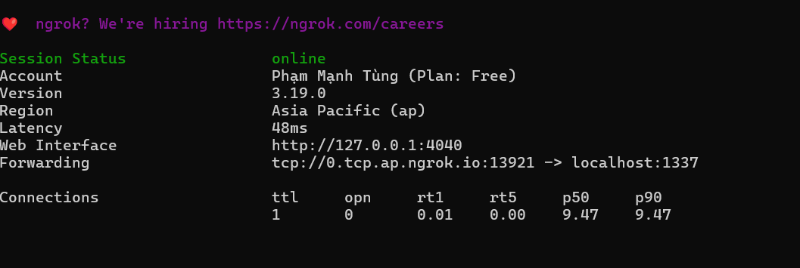
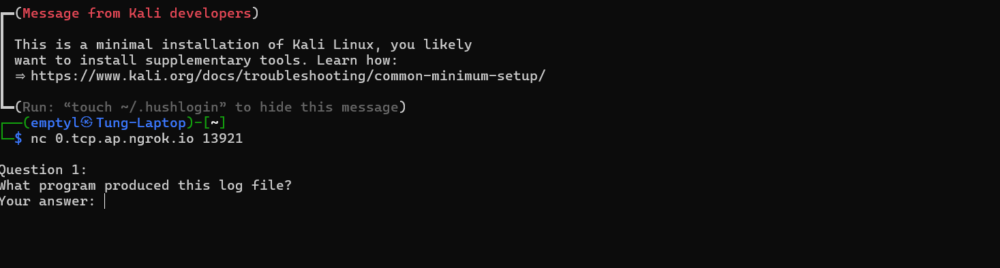

# Hướng dẫn cài đặt và sử dụng
Choose your language:
- [English](README_en.md)
- [Tiếng Việt](README_vn.md)


# Hướng dẫn cài đặt và sử dụng

## 1. Cấu hình câu hỏi
- Chỉnh sửa nội dung câu hỏi trong file `answers.json`

## 2. Khởi động server
```bash
docker compose up -d
```

## 3. Public server ra internet bằng Ngrok

### Cài đặt Ngrok trên Windows
1. Truy cập [trang tải Ngrok](https://ngrok.com/download) và tải về
2. Cài đặt Ngrok theo hướng dẫn
3. Đăng ký tài khoản tại [Ngrok Dashboard](https://dashboard.ngrok.com/get-started/setup/windows)
4. Lấy token xác thực từ [trang cài đặt](https://dashboard.ngrok.com/get-started/setup/windows)
5. Mở terminal và chạy lệnh:
   ```bash
   ngrok authtoken <your-token>
   ```

### Public server
Chạy lệnh sau để public server:
```bash
ngrok tcp 1337
```

## 4. Kết nối vào server

### Xem thông tin kết nối
Sau khi chạy `ngrok tcp 1337`, bạn sẽ thấy thông tin như hình:


Trong ví dụ trên:
- Địa chỉ server: `0.tcp.ap.ngrok.io`
- Port: `13921`
- Server này được forward tới port `1337` trên máy local

### Kết nối 
Sử dụng lệnh sau để kết nối vào server:
```bash
nc 0.tcp.ap.ngrok.io 13921
```

Kết quả khi kết nối thành công:

